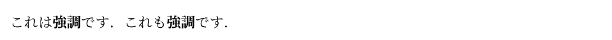
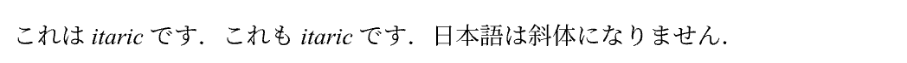
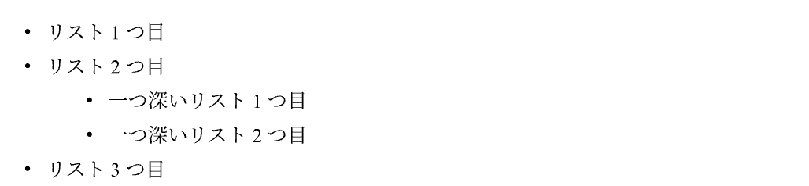
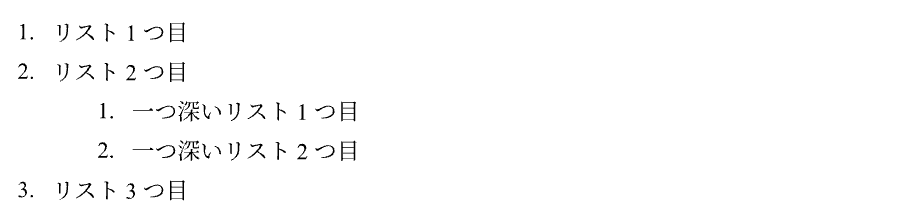

# マークアップモード
{: .no_toc }

マークアップモードは，文章を書くときに使用するモードです．
ここでは，マークアップモードで使用できる様々なオプション表示について紹介します．

## Table of contents
{: .no_toc .text-delta }

1. TOC
{:toc}

---

## 強調

**例**

```
これは*強調*です．
これも#strong[強調]です．
```

|:-|
|  |

- `*`で囲うことで，強調が可能です．
- `*`の代わりに`strong`関数も使用できます（が，あえて使用する必要はないはずです）．

---

## 斜体

**例**

```
これは_itaric_です．
これも#emph[itaric]です．
日本語は_斜体_になりません．
```

|:-|
|  |

- `_`で囲うことで，斜体表現が可能です．
- `_`の代わりに`emph`関数も使用できます（が，あえて使用する必要はないはずです）．
- 例のように，日本語では斜体は使用できません．

---

## 箇条書きリスト

**例**

```
- リスト1つ目
- リスト2つ目
    - 一つ深いリスト1つ目
    - 一つ深いリスト2つ目
- リスト3つ目
```

|:-|
|  |

- `- `で箇条書きリストとなります．
- ハイフンの後に半角スペースを設けないと，そのままハイフンが表示されます．
- `- `の位置を深くすることで，位置を制御することが可能です．

---

## 番号付きリスト

**例**

```
+ リスト1つ目
+ リスト2つ目
    + 一つ深いリスト1つ目
    + 一つ深いリスト2つ目
+ リスト3つ目
```

|:-|
|  |

- `+ `で番号付きリストとなります．
- プラスの後に半角スペースを設けないと，そのままプラスが表示されます．
- `+ `の位置を深くすることで，番号を制御することが可能です．
