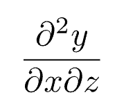

# 数式
{: .no_toc }

## Table of contents
{: .no_toc .text-delta }

1. TOC
{:toc}

---

## 数式の書き方

### 単独の数式

```
$ sin x $
```

|:-|
|  |

- `$ `と` $`で囲うことで，ディスプレイ形式の数式が書けます．
- `$`の前後に**半角スペースが必要**です．

### 文中の数式

```
これは，文の中の数式$sin x$です．
```

|:-|
|  |

- `$`で囲うことで，文中の数式が書けます．
- `$`の前後に半角スペースは入りません．前後両者ともにスペースを設けると，ディスプレイ形式の数式となります．

---

## 複数行の数式

```
$
    integral_0^(2pi) sin x &= [- cos x]_0^(2pi)#nonumber\
    &= 0
$
```

|:-|
|  |

- 強制改行`\`を使うことで，複数行の数式が書けます．
- 強制改行の前に，`#nonumber`を書くことで，その行に式番号がつかなくなります．途中式の場合は，極力式番号を出力せず，`#nonumber`を使うようにしてください．
- イコール等で行を揃えるには，揃える位置に`&`を書きます．

---

## physicaパッケージの利用

LaTeXでは，数式を簡単に書くためのphysics2パッケージが存在しますが，Typstではphysicaパッケージがあります．
以下はphysicaパッケージを利用して，偏微分を`pdv`コマンドで書いている例です．

```
$
    pdv(u_i, t) + u_j pdv(u_i, x_j) = - 1/rho pdv(p, x_i) + nu pdv(u_i, x_j, x_j) + f_i
$
```

|:-|
|  |

{: .note }
physicaパッケージには，様々な便利関数が含まれます．詳しくは，[physicaパッケージマニュアル](https://github.com/Leedehai/typst-physics/blob/v0.9.4/physica-manual.pdf)を参照してください．

以下は，physicaパッケージで微分を書く例です．

| コード | レンダリング |
|:-:|:-:|
| `dv(y, x)` |  |
| `dv(y, x, 2)` |  |
| `pdv(y, x)` |  |
| `pdv(y, x, 2)` |  |
| `pdv(y, x, z)` |  |
| `pdv(y, x, z, [2, 1])` |  |

この他にも，physicaパッケージには微分に留まらない多くの関数が存在します．
本テンプレートではデフォルトでこのパッケージを読み込むよう設定しているので，積極的に使用しましょう．
