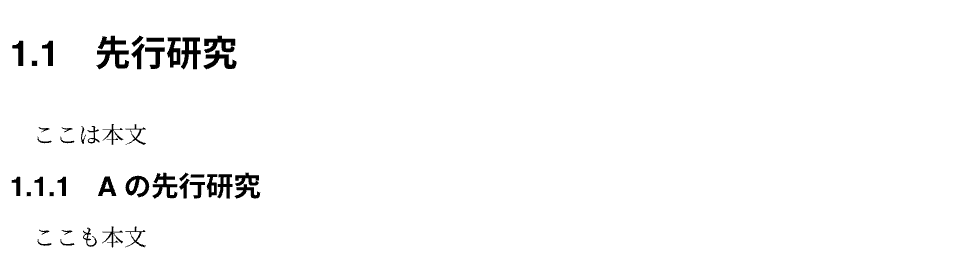

# 基本の文章
{: .no_toc }

## Table of contents
{: .no_toc .text-delta }

1. TOC
{:toc}

---

## ファイルの配置

学位論文の本体は `main.typ` ですが，論文の中身を書くのは，`chapter`フォルダの中にある`.typ`ファイル内です．
テンプレートでは，`chapter`フォルダに以下の8つのファイルが含まれています．

```bash
.
├── chapter
│   ├── acknowledgement.typ
│   ├── appendix.typ
│   ├── conclusion.typ
│   ├── discussion.typ
│   ├── introduction.typ
│   ├── method.typ
│   ├── result.typ
│   └── signary.typ
└── main.typ
```

これらのファイルに制限はないため，状況によって増やしたり減らしたりすることが可能です．

### 新しくチャプターを作るとき

例えば，新たに`turbulence.typ`ファイルを作成し，「乱流について」というチャプターを作りたいときは，以下のような手順で設定します．

1. `chapter`フォルダの中に`turbulence.typ`ファイルを作る
2. `turbulence.typ`の中に次のように書く
    ```
    #import "../style/thesis_style.typ": *

    = 乱流について
    <chapter:乱流について>
    ```
3. `main.typ`に以下の内容を追記して，新しく作ったファイルを認識させる
    ```
    //乱流について
    #include "chapter/turbulence.typ"
    ```

### チャプターを削除するとき

例えば，`chapter/discussion.typ`を削除するときは，以下のようにします．

1. `main.typ`内の以下の項目を削除する
    ```
    //考察
    #include "chapter/discussion.typ"
    ```

    このとき，`chapter`フォルダ内に残った`discussion.typ`は残しておいても削除してもかまいませんが，`main.typ`内で認識させている他のファイルは削除してはいけません．

---

## モード

Typstには，3種類の構文モードがあります．

| 種類         | 構文                     | 例                      |
| :----------- | :----------------------- | :---------------------- |
| マークアップ | マークアップを[..]で囲む | `let name = [*Typst!*]` |
| コード       | コードの前に#をつける    | `Number: #(1 + 2)`      |
| 数式         | 式を\$..\$で囲む         | `$sin x$`               |

- 文章を書くときは，マークアップモードです．明示的に数式モードやコードモードにしない限り，マークアップモードとなります．
- 数式を書くときは，\$で囲むことで数式モードにします．
- コードモードは，何らかの関数を呼び出す時に使用します．

---

## 文章を書く

学位論文に文章を加えるには，`chapter`フォルダの中にある`.typ`ファイル内を操作します．

```
こんにちは，世界．
今日はいい天気ですね．

明日は雨が降るかもしれません．
```

|:-|
|  |

- `.typ`内での改行は，出力結果に影響しません．
- `.typ`内で2行改行すると，段落が切り替わります．

{: .note }
> `.typ`内では，一文ごとに改行することを強く勧めます．
> これは，git上で差分管理する上で重要なことです．
> また，段落の切り替えは上記のように2行改行で対応してください．
> 強制改行コマンド`\`や`#linebreak()`は極力使用しないでください．

### 短縮記号機能

Typstには様々なマークアップ機能があり，具体的には[マークアップモード](#aux-links)で紹介します．
ここでは，短縮記号について紹介します．

```
Hello~World.

Large-Eddy Simulation

Navier--Stokes equation
```

|:-|
|  |

- `~`は**改行なしスペース**を設けます．`~`で繋がれた単語は，改行位置でも常に離れません．
- `-`は意味のある単語をつなげるために使用されます．上の例のように，Large-Eddy Simulationなどがこれに当てはまります．typst上では，`-`はそのまま出力されます．
- `--`は**enダッシュ**を表します．人物名を繋ぐ場合や，数値の範囲を表す場合に使用します．
  （数値の範囲とは，例えば「3〜5」と表記したいとき，論文では「`3--5`」と表記することを表します．）

### コメント機能

```
//ここにはコメントが入ります．
ここは1つ目の本文です．
/* このように書けば，複数行のコメントが可能です．
   ここもまだコメントです．
   ここまでがコメントです */
ここは2つ目の本文です．
```

|:-|
|  |

- 単行のコメントを書くには，`//`を利用します．
- 複数行のコメントを書くには，`/*`と`*/`を利用します．これらに囲まれた箇所はコメントとなり，出力されません．

---

## 節の配置

第1章など，章の配置方法は[新しくチャプターを作るとき](#新しくチャプターを作るとき)で紹介した方法で追加・削除ができます．
ここでは，第1.3節など，学位論文の節を構成する方法を紹介します．

```
== 先行研究
<section:先行研究>

ここは本文

=== Aの先行研究
<subsection:Aの先行研究>

ここも本文
```

|:-|
|  |

- `==`でセクションを構成します．
- `=`の数でより深いセクションが構成できます．
- `<..>`でセクションのラベルを構成します．本文中で第◯節と述べる際には，`@..`と書くことで引用できます．ラベルの作成は必須ではありませんが，なるべく書くようにしてください．
- ラベルの中身は任意の文字列が使用できるはずです．しかし上記のように明確なラベル付けがわかりやすいです．
- 同じ名前のラベルを複数つけてはいけません．

### 番号をつけない節の配置

```
#heading([先行研究], numbering: none, level: 2, outlined: false)
```

|:-|
|  |

通常この項目は使用しません．
しかし，一つの見出しにしたいが節にするほどでもないものに利用すると便利です．
この項目を多用すると見づらい論文となってしまうので，なるべく使わないことを勧めます．

**引数**

> ---
> **body**
> <span class="label label-green">contents</span>
>
> 節の題名を書きます．
>
> ---
> **numbering**
> <span class="label label-red">none</span>
> <span class="label label-purple">str</span>
>
> 番号をつけない場合にこれを追記します．
>
> デフォルト：`"1.1"`
>
> ---
> **level**
> <span class="label label-blue">int</span>
>
> 節の深さを設定します．
> `1`のときチャプタを作成し，`2`以降で節を作成します．
>
> デフォルト：`auto`
>
> ---
> **outlined**
> <span class="label label-yellow">bool</span>
>
> この項目を目次に入れるかを設定します．
> `true`で目次に追加し，`false`で目次に追加しません．
>
> デフォルト：`true`
>
> ---

{: .note }
> 付録の章では，デフォルトで番号がつきません．
> これは，本テンプレートの仕様です．
> このため，付録ではわざわざ`#heading(...)`を使用する必要はなく，通常通り`== ...`を利用できます．
