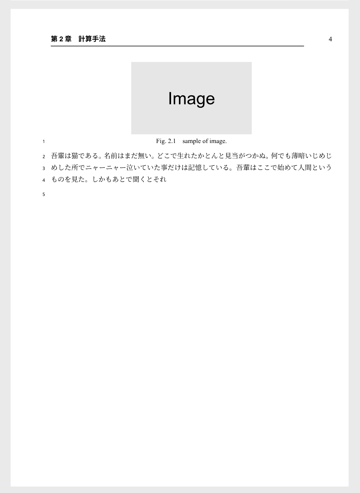
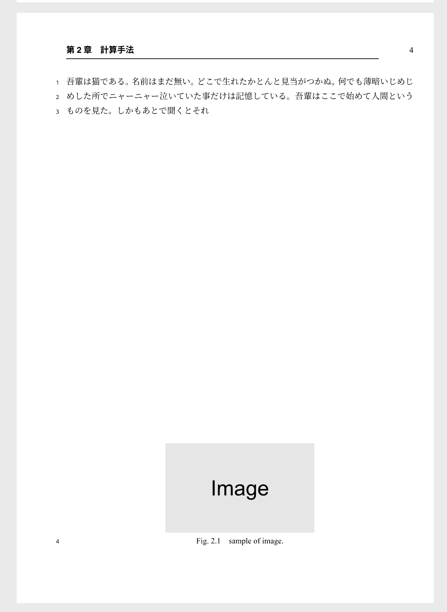
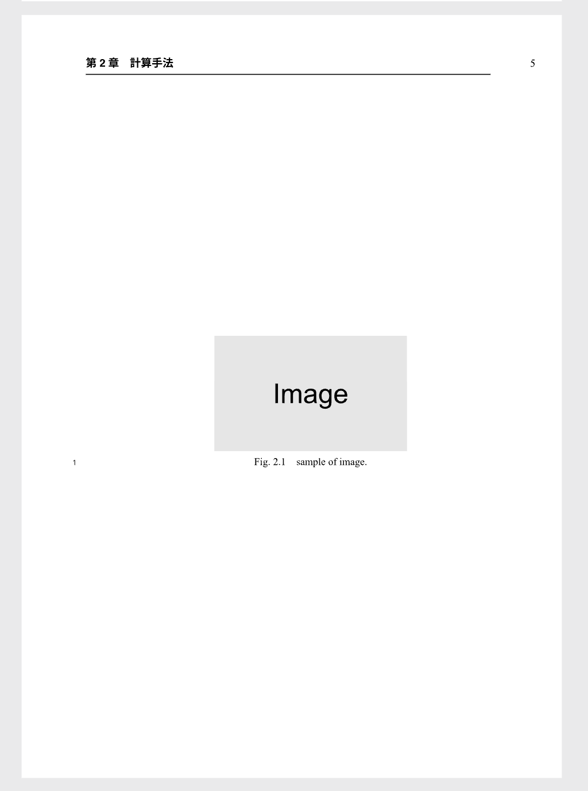

# 図が1枚のとき

{: .no_toc}

図が1枚のときの例です．
以下の例をそのまま貼り付けて使用できます．

## Table of contents

{: .no_toc .text-delta }

1. TOC
   {:toc}

---

## 配置を自動で行う

```
#fig(
    image("../figure/image.svg"),
    caption: [sample of image.],
    label: <sample>,
)
```

|:-|
|  |

{: .warning }
自動配置は，いつでも最適な位置に配置させるわけではありません．
望まない位置に配置された場合，以下の例のように手動で`placement`を定義する必要があります．

---

## 図をページ上部に配置する

```
#fig(
    image("../figure/image.svg"),
    caption: [sample of image.],
    label: <sample>,
    placement: top,
)
```

|:-|
|  |

---

## 図をページ下部に配置する

{: .warning }
この設定は，通常使用しません．
ページ下部に設定するのは，章の先頭のページに限られます．
また，abstractなどで使用する可能性があります．

```
#fig(
    image("../figure/image.svg"),
    caption: [sample of image.],
    label: <sample>,
    placement: bottom,
)
```

|:-|
|  |

---

## 図を単独ページに配置する

{: .warning }
この設定は，図が大きいとき，図の数が多いとき，あるいは図が既に単独で章の最終ページにあり`top`に配置されてしまっている場合に限られます．
図が1枚の場合では，**図が大きい場合，あるいは章の最終ページにあり`top`に配置されている場合にのみ使用する**こととなります．
単独ページに配置する図が多くなると，見づらい論文になるため注意が必要です．

```
#fig(
    image("../figure/image.svg"),
    caption: [sample of image.],
    label: <sample>,
    placement: page,
)
```

|:-|
|  |
