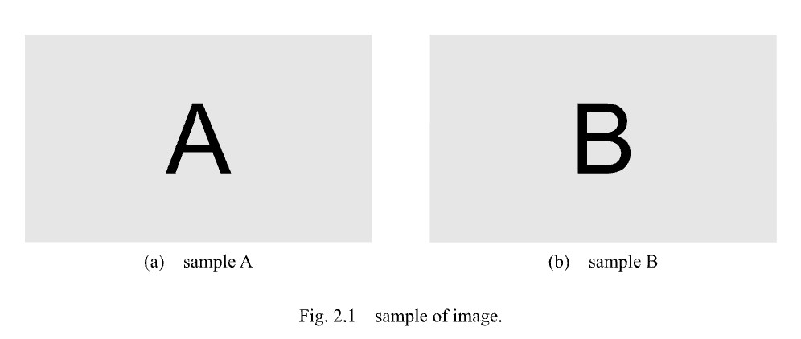
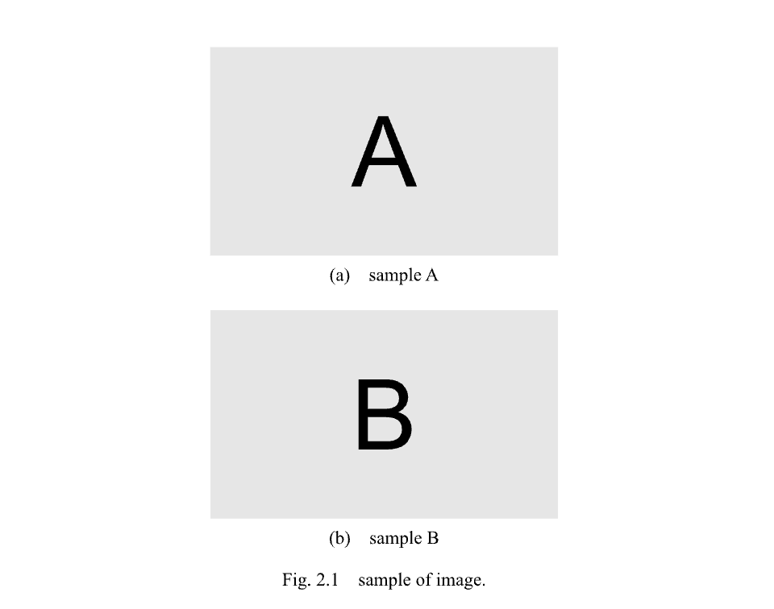
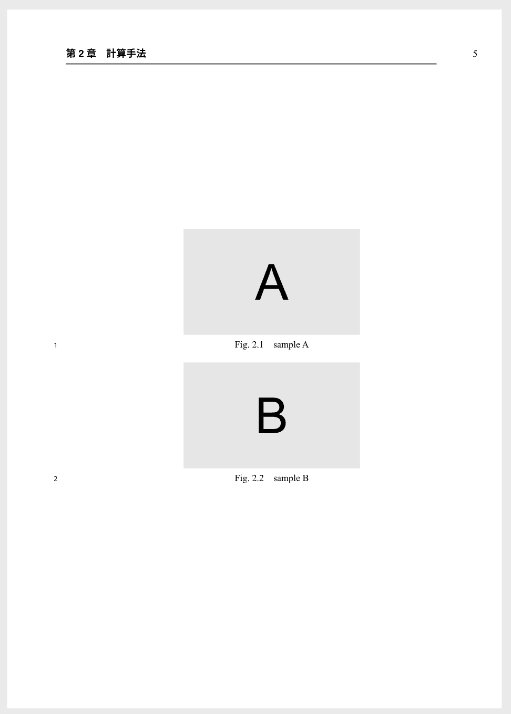
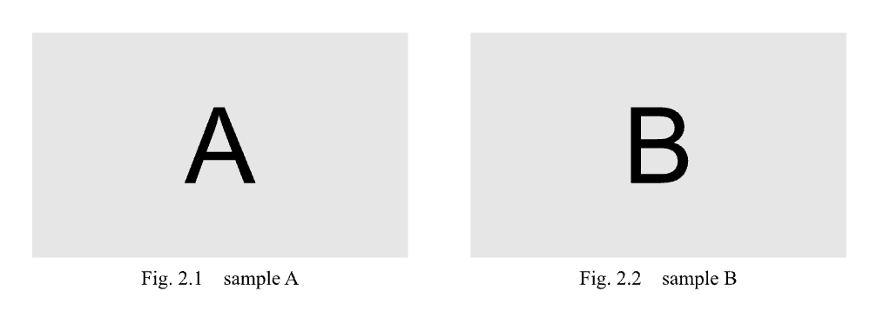

# 図が2枚のとき

{: .no_toc}

図が2枚のときの例です．
以下の例をそのまま貼り付けて使用できます．

## Table of contents

{: .no_toc .text-delta }

1. TOC
   {:toc}

---

## 配置を自動で行う

### 横に配置するとき

```
#fig(
    grid(
        columns: (50%, 50%),
        [
            #figure(
                image("../figure/image-A.svg"),
                caption: [sample A],
                kind: "sub-figure",
                supplement: [],
            )<sample-A>
        ],
        [
            #figure(
                image("../figure/image-B.svg"),
                caption: [sample B],
                kind: "sub-figure",
                supplement: [],
            )<sample-B>
        ]
    ),
    caption: [sample of image.],
    label: <sample>,
)
```

|:-|
|  |

---

### 縦に配置するとき

```
#fig(
    grid(
        columns: (100%),
        [
            #figure(
                image("../figure/image-A.svg"),
                caption: [sample A],
                kind: "sub-figure",
                supplement: [],
            )<sample-A>
        ],
        [
            #figure(
                image("../figure/image-B.svg"),
                caption: [sample B],
                kind: "sub-figure",
                supplement: [],
            )<sample-B>
        ]
    ),
    caption: [sample of image.],
    label: <sample>,
)
```

|:-|
|  |

{: .note }
上記の設定では自動配置の例を示していますが，最も外側の`fig`関数に`placement`を指定することで手動で配置することもできます．
配置の注意については，[図が1枚のとき]()を参照してください．

---

## 異なる図番号の図を単独ページに配置するとき

- スペースの関係で，異なる図番号の複数の図を単独ページに配置したいときがあります．
  このとき，一番外側に`fig`関数を利用し，内側は`figure`関数を利用します．
- `fig`関数では`kind`を`"none"`に，`supplement`を`[]`として指定します．
- 単独ページとするには，`placement`を`page`に指定します．

```
#fig(
    grid(
        columns: (100%),
        [
            #figure(
                image("../figure/image-A.svg"),
                caption: [sample A],
            )<sample-A>
        ],
        [
            #figure(
                image("../figure/image-B.svg"),
                caption: [sample B],
            )<sample-B>
        ]
    ),
    kind: "none",
    supplement: [],
    placement: page
)
```

|:-|
|  |

---

## 異なる図番号の図を横に配置するとき

{: .warning }
以下の方法はページ数を節約するために使用されますが，学位論文の場合はページ数に制限がないため，**基本的に使用しない**ようにしてください．
ただし，ページ数制約のあるabstractの作成時などには使用する可能性があります．

```
#fig(
    grid(
        columns: (50%, 50%),
        [
            #figure(
                image("../figure/image-A.svg"),
                caption: [sample A],
            )<sample-A>
        ],
        [
            #figure(
                image("../figure/image-B.svg"),
                caption: [sample B],
            )<sample-B>
        ]
    ),
    kind: "none",
    supplement: [],
)
```

|:-|
|  |
