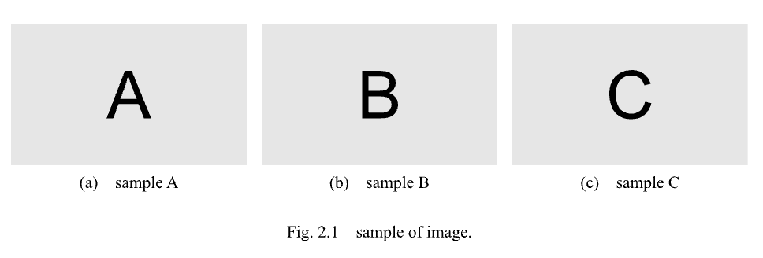
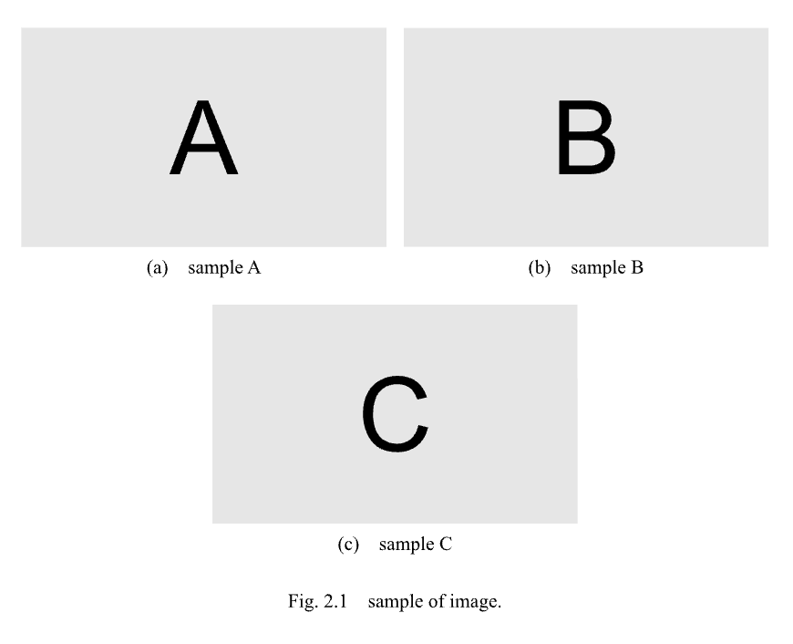
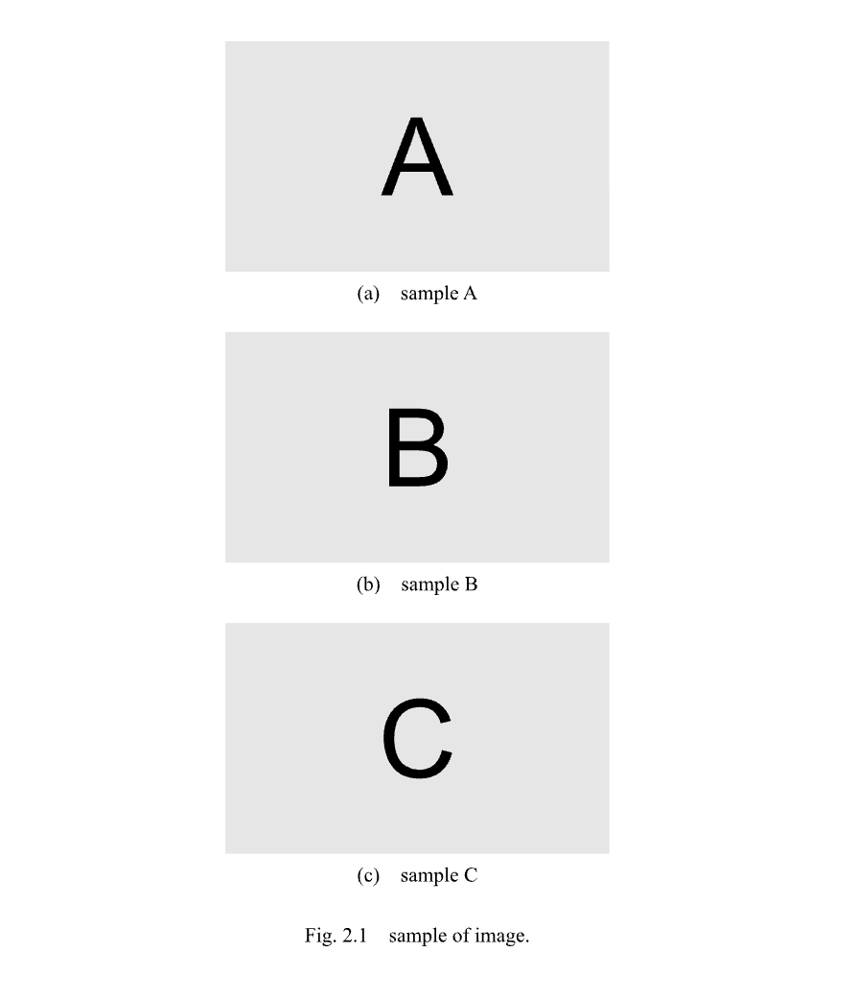

# 図が3枚のとき
{: .no_toc}

図が3枚のときの例です．
以下の例をそのまま貼り付けて使用できます．

## Table of contents
{: .no_toc .text-delta }

1. TOC
{:toc}

---

## 配置を自動で行う

### 横に配置するとき

```
#fig(
    grid(
        columns: (auto, auto, auto),
        column-gutter: 2%,
        [
            #figure(
                image("../figure/image-A.svg"),
                caption: [sample A],
                kind: "sub-figure",
                supplement: [],
            )<sample-A>
        ],
        [
            #figure(
                image("../figure/image-B.svg"),
                caption: [sample B],
                kind: "sub-figure",
                supplement: [],
            )<sample-B>
        ],
        [
            #figure(
                image("../figure/image-C.svg"),
                caption: [sample C],
                kind: "sub-figure",
                supplement: [],
            )<sample-C>
        ]
    ),
    caption: [sample of image.],
    label: <sample>,
)
```

|:-|
|  |

---

### 2個を横に配置し，1個を縦に配置するとき

```
#fig(
    grid(
        columns: (auto, auto),
        column-gutter: 2%,
        [
            #figure(
                image("../figure/image-A.svg"),
                caption: [sample A],
                kind: "sub-figure",
                supplement: [],
            )<sample-A>
        ],
        [
            #figure(
                image("../figure/image-B.svg"),
                caption: [sample B],
                kind: "sub-figure",
                supplement: [],
            )<sample-B>
        ],
        grid.cell(colspan: 2,[
            #figure(
                image("../figure/image-C.svg"),
                caption: [sample C],
                kind: "sub-figure",
                supplement: [],
            )<sample-C>
        ])
    ),
    caption: [sample of image.],
    label: <sample>,
)
```

|:-|
|  |

{: .note }
`grid.cell(colspan: 2, ..)`を利用すると，中心位置に要素を寄せることができます．
これは，図の数が増えても同じです．

---

### すべて縦に配置するとき

```
#fig(
    grid(
        columns: (auto),
        column-gutter: 2%,
        [
            #figure(
                image("../figure/image-A.svg"),
                caption: [sample A],
                kind: "sub-figure",
                supplement: [],
            )<sample-A>
        ],
        [
            #figure(
                image("../figure/image-B.svg"),
                caption: [sample B],
                kind: "sub-figure",
                supplement: [],
            )<sample-B>
        ],
        [
            #figure(
                image("../figure/image-C.svg"),
                caption: [sample C],
                kind: "sub-figure",
                supplement: [],
            )<sample-C>
        ]
    ),
    caption: [sample of image.],
    label: <sample>,
)
```

|:-|
|  |

{: .note }
上記の設定では自動配置の例を示していますが，最も外側の`fig`関数に`placement`を指定することで手動で配置することもできます．
配置の注意については，[図が1枚のとき]()を参照してください．
