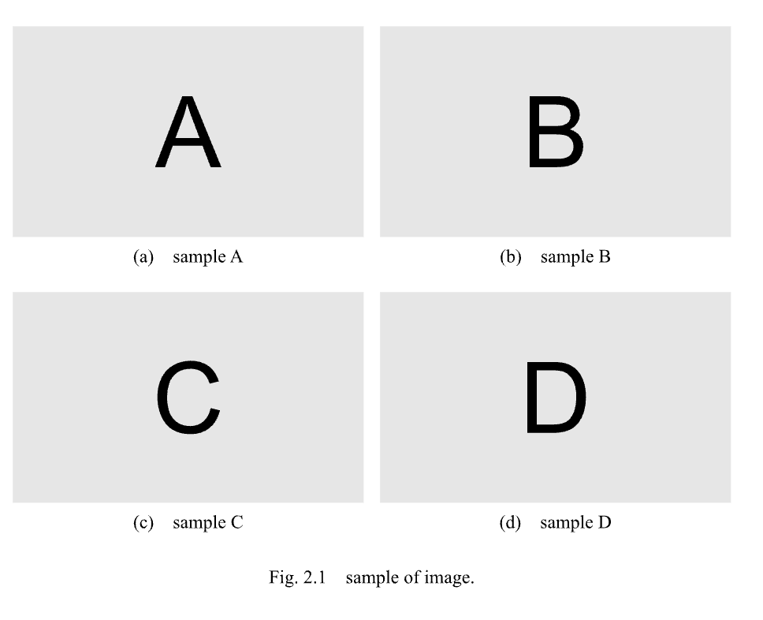
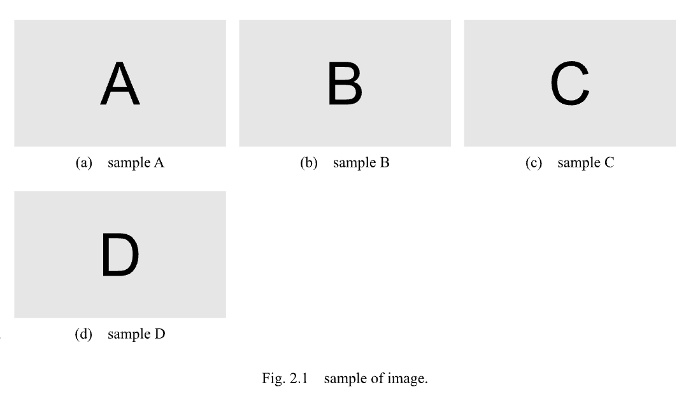

# 図が4枚以上のとき
{: .no_toc}

図が4枚以上のときの例です．
以下の例をそのまま貼り付けて使用できます．
4枚以上のときは，横に並べる数を2個か3個に制限することを勧めます．
これ以上小さくなると，見づらいためです．

## Table of contents
{: .no_toc .text-delta }

1. TOC
{:toc}

---

## 配置を自動で行う

### 2個ずつ並べるとき

```
#fig(
    grid(
        columns: (auto, auto),
        column-gutter: 5%,
        [
            #figure(
                image("../figure/image-A.svg"),
                caption: [sample A],
                kind: "sub-figure",
                supplement: [],
            )<sample-A>
        ],
        [
            #figure(
                image("../figure/image-B.svg"),
                caption: [sample B],
                kind: "sub-figure",
                supplement: [],
            )<sample-B>
        ],
        [
            #figure(
                image("../figure/image-C.svg"),
                caption: [sample C],
                kind: "sub-figure",
                supplement: [],
            )<sample-C>
        ],
        [
            #figure(
                image("../figure/image-D.svg"),
                caption: [sample D],
                kind: "sub-figure",
                supplement: [],
            )<sample-D>
        ]
    ),
    caption: [sample of image.],
    label: <sample>,
)
```

|:-|
|  |

---


### 3個ずつ並べるとき

```
#fig(
    grid(
        columns: (auto, auto, auto),
        column-gutter: 2%,
        [
            #figure(
                image("../figure/image-A.svg"),
                caption: [sample A],
                kind: "sub-figure",
                supplement: [],
            )<sample-A>
        ],
        [
            #figure(
                image("../figure/image-B.svg"),
                caption: [sample B],
                kind: "sub-figure",
                supplement: [],
            )<sample-B>
        ],
        [
            #figure(
                image("../figure/image-C.svg"),
                caption: [sample C],
                kind: "sub-figure",
                supplement: [],
            )<sample-C>
        ],
        [
            #figure(
                image("../figure/image-D.svg"),
                caption: [sample D],
                kind: "sub-figure",
                supplement: [],
            )<sample-D>
        ]
    ),
    caption: [sample of image.],
    label: <sample>,
)
```

|:-|
|  |

{: .note }
これ以上図の数が増えたときでも，上記の例をコピーして要素を増やせば使用できます．
