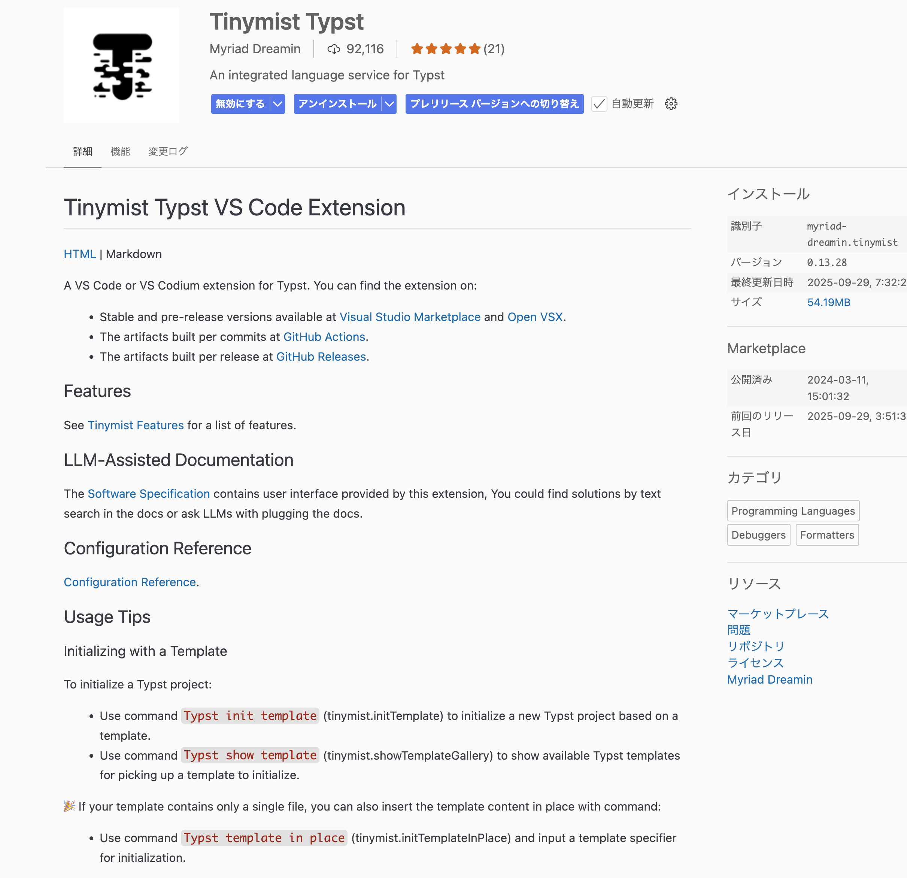

# 環境構築

ここでは，Typst環境を構築する方法について述べます．

## Visual Studio Codeの準備

1. [Visual Studio Code](https://azure.microsoft.com/ja-jp/products/visual-studio-code)をインストールする

    1. [https://azure.microsoft.com/ja-jp/products/visual-studio-code](https://azure.microsoft.com/ja-jp/products/visual-studio-code)にアクセス
    1. ページの「VS Codeをダウンロードする」に移動
    
    1. 自分のPCに当てはまる項目を選択し，ダウンロード
        
    1. ダウンロードしたインストーラを開き，案内に従ってインストール

1. 日本語設定をする

---

## Typstの準備

1. VSCodeの拡張機能で`Typst`を検索し，`Typst Timinist`をインストールする
    


## Typstコマンドの設定

通常，Typstを使用する際にはTypst Tiministを使用しますが，本テンプレートで差分を取る際には，`typst`コマンドを使用します．
このため，以下の手順でTypstコマンドを使用できるようにします．

### MacOSの場合

1. `brew`をインストールする
1. 以下のコマンドを実行して，`typst`コマンドをインストールする

    ```bash
    brew install typst
    ```

### Windowsの場合

1. コマンドライン上で以下のコマンドを実行して，`typst`コマンドをインストールする

    ```powershell
    winget install --id Typst.Typst
    ```

1. `typst.exe`のパスを以下のコマンドで表示
    ```powershell
    where typst
    ```
    して，`typst.exe`のパスをコピーしておく（例：`C:\Users\<username>\AppData\Local\Microsoft\WinGet\Links\`）．
    このとき，`typst.exe`の部分は含めないこと．

1. Git Bashを起動し，`~/.bashrc`を開く

    ```bash
    nano ~/.bashrc
    ```

1. `~/.bashrc`の最後に以下の行を追加し，先ほどコピーした`typst.exe`のパスを貼り付ける

    ```bash
    export PATH=$PATH:パス
    ```
1. `Ctrl + X`，`Y`，`Enter`の順に押して保存する

1. Git Bashを再起動し，以下のコマンドを実行して`typst`コマンドが使用できることを確認する

    ```bash
    typst --version
    ```

---

## 学位論文テンプレートの準備

本テンプレートを使用して学位論文を執筆するためには，以下の手順でリポジトリを準備します．
また，typstは**自動的にフォントをインストールできない**ため，自分の環境にフォントを手動でインストールする必要があります．

### クローンとリモートの設定

1. Organizationではなく，個人のGitHubアカウントに空のリポジトリを作成．
    ここでは仮に`master_thesis`というリポジトリ名にする．
    **リポジトリ作成時に`README.md`や`.gitignore`は作成しない**

1. Privateリポジトリになっていることを確認したら，Create repositoryを押す．


1. このテンプレートをcloneする
    ```bash
    git clone git@github.com:tsukahara-lab/TUS-ME_thesis_typst_template.git master_thesis
    cd master_thesis
    ```

1. remote設定を書き換える（例えば塚原先生（`tsukapom`）が修士論文を執筆する場合）
    ```bash
    # リモートURLを自身のものに変更
    git remote set-url origin git@github.com:tsukapom/master_thesis

    # URLの変更が反映されているか確認
    git remote -v

    # 自身のリモートリポジトリにテンプレートの中身を反映
    git push origin HEAD
    ```

1. Github上の自分のリポジトリにアクセスし，`main`ブランチが存在することを確認する．

### フォントの設定

1. このリポジトリの`fonts`ディレクトリを開き，ここに含まれているフォントを全てインストールする．
