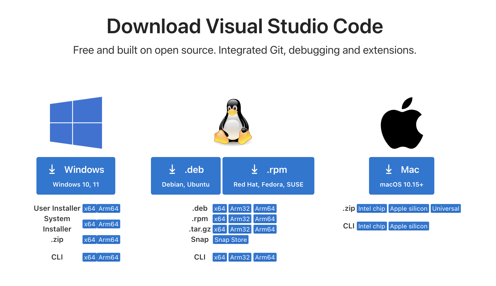

# 環境構築

ここでは，Typst環境を構築する方法について述べます．

## Visual Studio Codeの準備

1. [Visual Studio Code](https://azure.microsoft.com/ja-jp/products/visual-studio-code)をインストールする

    1. [https://azure.microsoft.com/ja-jp/products/visual-studio-code](https://azure.microsoft.com/ja-jp/products/visual-studio-code)にアクセス
    1. ページの「VS Codeをダウンロードする」に移動
    
    1. 自分のPCに当てはまる項目を選択し，ダウンロード
        
    1. ダウンロードしたインストーラを開き，案内に従ってインストール

1. 日本語設定をする

## Typstの準備

1. Typst Tiministをインストールする

## 学位論文テンプレートの準備

{: .warning }
> gitとGithubの準備ができていない場合は，先に [gitとGithub](#aux-links) のページで設定を行ってください

1. このテンプレートをcloneする
    ```bash
    https://github.com/tkrhsmt/TUS-ME_thesis_typst_template.git
    ```

1. remote設定を書き換える
