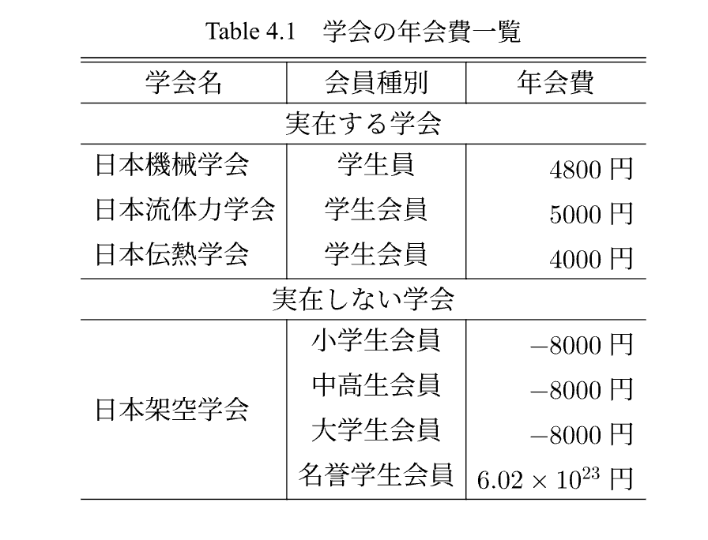

# 表の挿入

表を挿入するには，`fig`関数の中に`tblr`関数を入れることで実現できます．
以下は，学会の年会費一覧を表にした例です．

```typst
#fig(
  tblr(
    columns: 3,
    align: (left, center, right),
    align(center)[学会名], align(center)[会員種別], align(center)[年会費], table.hline(),
    table.cell(colspan: 3, align: center)[実在する学会], table.hline(),
    [日本機械学会], [学生員], [$4800$円],
    [日本流体力学会], [学生会員], [$5000$円],
    [日本伝熱学会], [学生会員], [$4000$円], table.hline(),
    table.cell(colspan: 3, align: center)[実在しない学会], table.hline(),
    table.cell(rowspan: 4, align: horizon)[日本架空学会],
    [小学生会員], [$-8000$円],
    [中高生会員], [$-8000$円],
    [大学生会員], [$-8000$円],
    [名誉学生会員], [$6.02 times 10^23$円],
  ),
  caption: [学会の年会費一覧],
  label: <table:学会の年会費一覧>,
)
```

|:-|
|  |


typstの組込み関数である`table`関数も使用できますが，本テンプレートで実装した`tblr`関数を使用すると，機械学会の論文フォーマットに近い表を簡単に作成できます．
